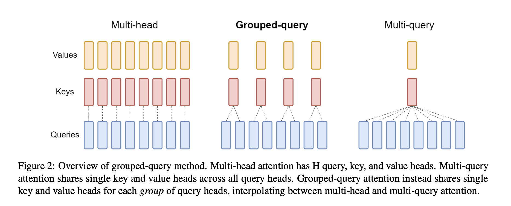

# Grouped-Query Attention(GQA)

<figure><figcaption></figcaption></figure>

将MAQ中的key、value的注意力头数设置为一个能够被原本的注意力头数整除的一个数字，也就是group数。

**MQA和GQA并没有减少模型的计算量，但是模型的参数量会减少，优化了显存的换入换出，在解码过程中由于key和value的数量级远远小于query的数量级，所以在自回归解码时可以将已经计算出来的key和value一直高速缓存中，减少数据换入换出的次数，以此来提升速度。**
